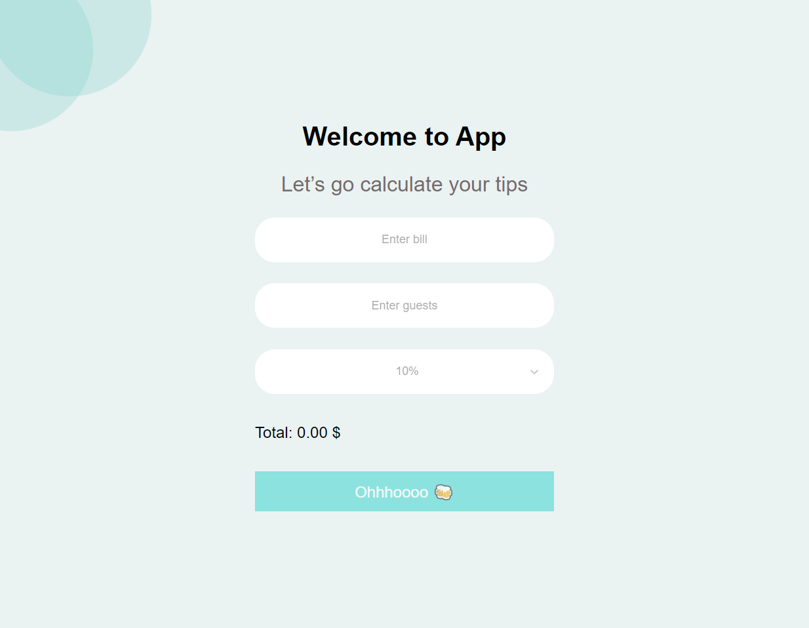

<!-- PROJECT LOGO -->
 

   <h3 align="center">Tips Calculator</h3>

  

    <a href="https://marshitsky.github.io/react-tips-calculator/">View Demo</a>
  

<!-- TABLE OF CONTENTS -->

  
Table of Contents

  <ol>
    <li>
      <a href="#about-the-project">About The Project</a>
      <ul>
        <li><a href="#built-with">Built With</a></li>
      </ul>
    </li>
    <!-- <li>
      <a href="#getting-started">Getting Started</a>
      <ul>
        <li><a href="#prerequisites">Prerequisites</a></li>
        <li><a href="#installation">Installation</a></li>
      </ul>
    </li>
    <li><a href="#usage">Usage</a></li> -->
    <!-- <li><a href="#roadmap">Roadmap</a></li> -->
    <!-- <li><a href="#contributing">Contributing</a></li> -->
    <!-- <li><a href="#license">License</a></li> -->
    <li><a href="#contact">Contact</a></li>
    <!-- <li><a href="#acknowledgments">Acknowledgments</a></li> -->
  </ol>

<!-- ABOUT THE PROJECT -->

## About The Project

A tip calculation app created with React. 
With this app, you can easily divide the check amount by the number of guests, taking into account the waiter's tips.

### Built With
 

* 
* 

### Tools used
 

* Typescript
* React-select
* Styled-components
* gh-pages

 

## Contact

Miroslav - [@MirMar](https://t.me/MirMar) - marshitsky@gmail.com

Project Link: [https://github.com/marshitsky/react-tips-calculator](https://github.com/marshitsky/react-tips-calculator)
